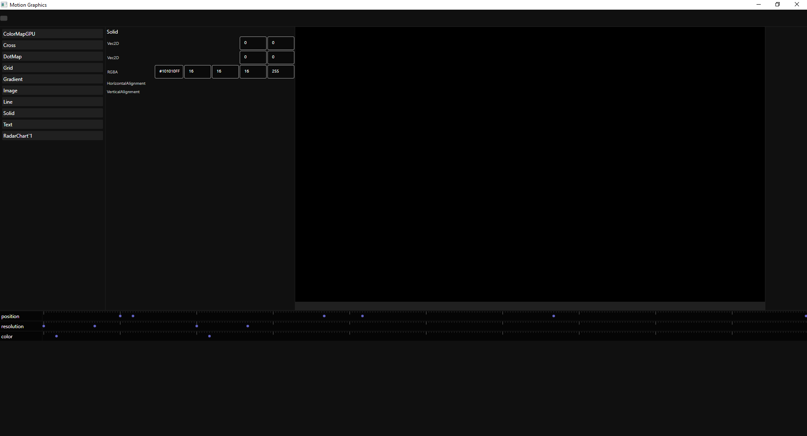

# MotionGraphics UI
This Projekt is in an early developement stage. Things are not done yet and up to change.

MotionGraphics UI is Graphical User Interface for Skmr.Editor . It allows users without programming experience to use the Motion Graphics Library from Skmr Editor and work more percise and preview the changes before rendering the image sequence. The purpose of the Program is to automate the generation of many different versions based on data that is provided. For Example if you want to make graphics based on the weather you should only need to setup a template and each day you can generate a new report based on that template.

